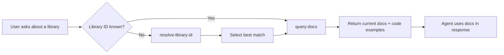

# find-docs

AI agent skill for real-time library documentation lookup via [Context7](https://context7.com).

Works with: **Antigravity** · **Gemini CLI** · **Claude Code** · **Cursor** · **Copilot** · **Windsurf** · **Codex CLI**

## What It Does

Teaches AI coding agents to **automatically** fetch up-to-date documentation and code examples when working with any library, framework, or SDK — eliminating hallucinated APIs and outdated code patterns.

```
You: "Add JWT auth middleware to my Next.js app"
Agent: (auto-fetches Next.js 15 docs via Context7) → gives correct, current code
```

### Features

- 🔄 **Auto-activation** — triggers on any library-related question (no "use context7" needed)
- 🎯 **MCP-first** — uses `resolve-library-id` + `query-docs` MCP tools (fast, native)
- 🔧 **CLI fallback** — `ctx7 library` + `ctx7 docs` when MCP is unavailable
- 📋 **20+ pre-mapped libraries** — React, Next.js, Tailwind, Prisma, Ethers.js, and more
- 🆕 **New project setup** — auto-detects dependencies and offers to configure per-project library mappings
- 📦 **Templates included** — ready-to-use workflow and `AGENTS.md` section for any project

## Installation

> **Note:** The GitHub repo is called `find-docs-skill`, but the skill folder
> must be named **`find-docs`**. The install commands below handle this
> automatically.

### Global skills directory paths

| Agent       | Global skills path              |
| ----------- | ------------------------------- |
| Antigravity | `~/.gemini/antigravity/skills/` |
| Gemini CLI  | `~/.gemini/skills/`             |
| Claude Code | `~/.claude/skills/`             |
| Cursor      | `~/.cursor/skills/`             |
| Windsurf    | `~/.codeium/windsurf/skills/`   |
| Codex CLI   | `~/.codex/skills/`              |

### Option 1: Clone directly into skills directory (recommended)

Clone the repo directly into the correct folder name:

```bash
# Antigravity
git clone https://github.com/ivannikov-pro/find-docs-skill.git \
  ~/.gemini/antigravity/skills/find-docs

# Gemini CLI
git clone https://github.com/ivannikov-pro/find-docs-skill.git \
  ~/.gemini/skills/find-docs

# Claude Code
git clone https://github.com/ivannikov-pro/find-docs-skill.git \
  ~/.claude/skills/find-docs
```

### Option 2: Per-project only

Clone into your project's local skills directory:

```bash
git clone https://github.com/ivannikov-pro/find-docs-skill.git \
  .agents/skills/find-docs
```

Or copy just the `SKILL.md`:

```bash
mkdir -p .agents/skills/find-docs
curl -o .agents/skills/find-docs/SKILL.md \
  https://raw.githubusercontent.com/ivannikov-pro/find-docs-skill/master/SKILL.md
```

### Prerequisites

- **Context7 MCP server** must be configured in your agent's MCP config:

```json
{
  "mcpServers": {
    "context7": {
      "command": "npx",
      "args": ["-y", "@upstash/context7-mcp@latest"]
    }
  }
}
```

- **API key** (optional, for higher rate limits): get one free at [context7.com/dashboard](https://context7.com/dashboard)

## File Structure

```
find-docs-skill/          ← repo name (GitHub)
find-docs/                ← skill folder name (after install)
├── SKILL.md                        # Main skill file (agent reads this)
├── LICENSE                         # MIT
├── README.md                       # This file
└── assets/
    ├── workflow-template.md        # Template: .agents/workflows/find-docs.md
    └── agents-md-section.md        # Template: Context7 section for AGENTS.md
```

## Per-Project Setup

Use the included templates to customize Context7 for each project:

1. **Copy** `assets/workflow-template.md` → `.agents/workflows/find-docs.md`
2. **Append** `assets/agents-md-section.md` content to your `AGENTS.md`
3. **Fill in** your project's library IDs (use `resolve-library-id` to find them)

Or just ask your agent: *"Set up Context7 docs lookup for this project"* — the skill instructs the agent to do this automatically.

## Common Library IDs

| Domain     | Library      | Context7 ID                 |
| ---------- | ------------ | --------------------------- |
| Frontend   | Next.js      | `/vercel/next.js`           |
| Frontend   | React        | `/facebook/react`           |
| Frontend   | Vue.js       | `/vuejs/vue`                |
| Styling    | Tailwind CSS | `/tailwindlabs/tailwindcss` |
| Backend    | Express      | `/expressjs/express`        |
| Database   | Prisma       | `/prisma/prisma`            |
| Database   | Drizzle      | `/drizzle-team/drizzle-orm` |
| BaaS       | Supabase     | `/supabase/supabase`        |
| Blockchain | Ethers.js v6 | `/websites/ethers_v6`       |
| Blockchain | Viem         | `/wevm/viem`                |
| Blockchain | OpenZeppelin | `/openzeppelin/contracts`   |
| Blockchain | Foundry      | `/foundry-rs/foundry`       |
| Wallet     | Reown AppKit | `/websites/reown`           |
| Testing    | Vitest       | `/vitest-dev/vitest`        |
| Testing    | Playwright   | `/microsoft/playwright`     |

Use `resolve-library-id` to find IDs for any library not listed here.

## How It Works



## Compatibility

Based on the [agentskills.io](https://agentskills.io) specification (Anthropic, Dec 2025). Compatible with any agent that reads `SKILL.md` files from a skills directory.

## Credits

- **Context7** by [Upstash](https://github.com/upstash/context7) — the documentation engine
- **Agent Skills Standard** by [Anthropic](https://agentskills.io) — the skill format

## License

[MIT](LICENSE)
